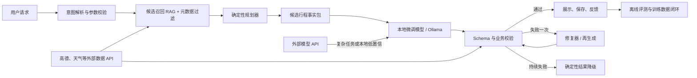

# TripCraft AI 架构优化设计

> 版本：v1.0
> 日期：2026-08-12
> 目标：将 TripCraft 从“由大模型直接生成旅游行程”升级为“以可信数据和确定性规划为核心、模型增强表达与交互”的旅行决策产品。

---

## 1. 背景与问题

TripCraft 当前已经具备 POI 数据库、TF-IDF 检索、行程生成、验证、天气、用户收藏与反馈能力。主行程链路位于 `backend/api/generate.py`、`backend/services/model_service.py`、`backend/services/rag_service.py`。

目前的核心问题是：LLM 同时被要求选择景点、规划路线、计算预算和输出文案。这会带来事实幻觉、费用或坐标不一致、结果不稳定以及本地模型质量受限的问题。

产品应以“可信旅行决策”为核心承诺：景点、坐标、价格、天气和路线都应来自可追溯的数据与算法；模型用于理解用户、生成结构化表达和处理开放式问题。

## 2. 设计原则

1. **事实不训练，数据可追溯。** 实时或经常变化的景点、天气、票价、营业时间、交通信息必须来自数据库或外部数据 API。
2. **约束不交给模型。** 预算、景点去重、路线距离、营业时间和可用性由确定性规划器计算与校验。
3. **模型做表达和理解。** 本地微调模型负责固定 JSON 格式、行程摘要、提示语和旅行问答；外部模型处理复杂、长尾和低置信任务。
4. **检索先于生成。** 所有涉及 POI 的模型请求都先检索并只允许模型使用候选集合。
5. **校验失败必须重试或降级。** 不向用户展示未通过关键约束校验的模型结果。
6. **成本和隐私可控。** 默认本地模型；仅把必要的最小化上下文发送至外部模型，并记录调用原因与成本。

## 3. 目标架构



### 3.1 服务边界

| 服务 | 责任 | 不能承担的责任 |
|---|---|---|
| POI 数据服务 | 保存 POI、评分、坐标、价格、标签、数据来源与更新时间 | 生成行程文案 |
| RAG 服务 | 根据城市、偏好和语义召回候选 POI 与攻略片段 | 确定路线和预算 |
| 规划器 | 对候选 POI 做评分、去重、预算控制、时间安排、地理排序 | 编造事实和开放式对话 |
| LLM Provider | 调用 Ollama 或外部模型，返回受约束内容 | 直接作为事实源 |
| 验证器 | 校验 Schema、候选引用、预算、路线、动态数据 | 代替规划器生成方案 |
| 外部数据适配器 | 高德 POI/天气、交通等实时数据访问和缓存 | 承担 LLM 推理 |

## 4. 能力路由策略

### 4.1 本地训练模型（Ollama）

本地模型是默认生成器，建议训练目标为 Qwen 7B 级模型的 LoRA/QLoRA。它只接收由系统生成的“事实包”，而不是整库 POI。

适用场景：

- 将已确定的景点顺序转成 TripCraft 行程 JSON。
- 生成每日摘要、交通说明、注意事项和推荐理由。
- 结合 RAG 上下文回答常规城市和景点问答。
- 从自然语言抽取目的地、日期/天数、预算、偏好、同行人群等结构化参数。
- 生成行李清单的说明文字，不负责清单规则本身。

不适用场景：

- 最新门票、营业时间、天气、实时交通与酒店价格。
- 新城市 POI 的采集和真实性判断。
- 预算、路线距离和用户权限的最终决定。

### 4.2 外部模型 API

外部模型保留为能力扩展与质量兜底，不再是所有请求的默认依赖。

适用场景：

- 多城市联程、复杂约束、多轮深度问答等本地模型低置信任务。
- 本地模型两次输出仍未通过 Schema 或业务校验时的最后一次回退。
- 训练数据教师模型：生成候选样本、改写用户需求、生成困难负例、辅助标注。
- 离线评测中的质量裁判，但最终判断仍以规则与人工抽检为准。

外发约束：仅发送与请求相关的候选 POI、用户匿名化偏好和必要上下文；不发送账号、邮箱、完整历史记录或内部密钥。

### 4.3 RAG

RAG 是“知识与候选召回层”，而非事实真相或规划器。

| 使用位置 | 检索内容 | 输出用途 |
|---|---|---|
| 行程生成前 | 城市、偏好、预算、同行人群匹配的 POI | 输入规划器，得到候选池 |
| 桌宠聊天 | 用户问题、当前城市、当前行程、POI 资料 | 输入本地/外部模型回答 |
| 景点替换 | 同城、同类、相近位置、预算可接受的 POI | 编辑行程的替代候选 |
| 训练样本构建 | 已验证 POI 与行程事实包 | 生成并筛选训练数据 |

## 5. 主行程生成链路

### 5.1 输入协议

统一 `GenerateRequest`，流式和非流式接口必须使用同一请求模型：

```json
{
  "destination": "杭州",
  "days": 3,
  "budget": 3000,
  "preferences": ["自然风光", "美食"],
  "favorite_poi_ids": [64, 136],
  "travelers": {"adults": 2, "children": 0},
  "pace": "relaxed",
  "start_date": "2026-10-01"
}
```

### 5.2 分步处理

1. **参数和可用城市检查**：校验天数、预算、偏好；若本地没有城市数据，调用高德 POI 采集，完成入库、标注数据版本并异步重建索引。
2. **候选召回**：先用 metadata 过滤城市、类别、预算和人群，再使用向量检索补充语义相关性；候选量建议为 `days * 8`，而不是仅 `days * 3`。
3. **确定性规划**：评分包含偏好匹配、用户收藏、评分、距离、预算、营业约束和历史负反馈；以地理聚类再做日内路线排序。
4. **事实包生成**：规划器输出不可由模型修改的 `poi_id`、名称、坐标、门票、时长、每日顺序、交通距离和费用。
5. **模型表达**：本地模型只生成 `summary`、`note`、`transport_advice` 等允许字段，或按 JSON Schema 输出；后端基于 `poi_id` 回填其余字段。
6. **验证与修复**：先 JSON Schema，再 POI 引用、预算、时间、距离和动态数据校验。失败时将具体错误交给修复器一次；仍失败则直接展示规划器的确定性行程。
7. **持久化与观测**：保存输入、候选池版本、规划版本、模型版本、验证结果、回退原因和用户后续编辑。

### 5.3 输出信任边界

模型可以生成：`summary`、`note`、`transport_advice`、`reason`。

模型不能决定：`poi_id`、`spot`、`lat`、`lng`、`cost`、`duration`、`day_cost`、`total_cost`。这些字段只从数据库和规划器回填。

## 6. LLM Provider 抽象

将当前 `backend/services/llm_service.py` 改为统一接口，而不是把 Ollama 地址直接写入业务代码。

```python
class LLMProvider:
    async def generate_json(self, messages, schema, temperature=0.2) -> dict: ...
    async def stream_chat(self, messages, temperature=0.7): ...

class OllamaProvider(LLMProvider): ...
class OpenAICompatibleProvider(LLMProvider): ...
class DisabledProvider(LLMProvider): ...
```

建议配置：

```env
LLM_DEFAULT_PROVIDER=ollama
OLLAMA_BASE_URL=http://localhost:11434
OLLAMA_MODEL=tripcraft
LLM_FALLBACK_PROVIDER=external
EXTERNAL_LLM_MODEL=meituan-longcat/LongCat-2.0
EXTERNAL_LLM_API_BASE=https://api.siliconflow.cn/v1/chat/completions
JWT_SECRET=change-this-to-a-random-secret
```

推荐路由：

```text
普通行程 / 常规问答: Ollama -> 验证 -> 确定性降级
复杂行程: Ollama -> 验证 -> 外部模型 -> 验证 -> 确定性降级
实时事实: 外部数据 API，不经 LLM 判定
```

## 7. RAG 演进方案

### 7.1 短期

- 保留当前 TF-IDF 作为名称、城市和类别的快速召回。
- 修复聊天检索：`backend/api/chat.py` 必须将用户 `message` 作为 query，而不是仅以城市与“旅游景点”检索。
- 以 POI 内容哈希或 `updated_at` 判断索引是否过期，替代当前仅比较 POI 数量的方式。
- 新 POI 入库后失效 `poi:*` 缓存并触发索引增量更新。

### 7.2 中期

- 增加中文 embedding（例如 BGE-M3），保留 BM25/TF-IDF 做混合检索。
- POI 增加元数据：`indoor`、`suitable_for`、`opening_hours`、`price_source`、`updated_at`、`source`、`confidence`。
- 使用 metadata 过滤后再向量召回；按相关性、评分、距离、用户偏好和数据新鲜度重排序。
- 建立单独的攻略知识库，将 POI 事实、用户评论和编辑内容分库分权限检索。

## 8. 训练与数据闭环

### 8.1 训练目标

本地 LoRA 不训练“旅游知识”，训练以下稳定能力：

- 严格遵守 TripCraft JSON/工具调用协议。
- 只引用输入事实包中提供的 `poi_id`。
- 生成清晰、简洁、具有旅行场景感的摘要和注意事项。
- 正确处理天数、预算、偏好、亲子/老人等约束的表达。
- 对缺失信息提出澄清，而不是编造。

### 8.2 数据来源与质量门槛

| 数据来源 | 用途 | 质量要求 |
|---|---|---|
| 人工审核的真实行程 | SFT 黄金样本 | 必须通过全部业务验证 |
| 用户编辑后的最终行程 | 偏好与重排序样本 | 记录修改前后差异与原因 |
| 外部模型教师生成 | 扩充候选样本 | 必须通过验证和抽检，不能直接入训 |
| 低评分/验证失败案例 | 负样本与修复样本 | 标明具体失败标签 |
| 收藏、替换、评分行为 | 排序特征 | 聚合使用，避免单样本在线训练 |

训练集至少按“用户请求/城市组合”切分训练、验证、测试；测试集不允许与训练集出现相同 POI 序列。当前快速样本不能用于正式训练。

### 8.3 离线评测指标

- JSON Schema 合法率 >= 99%。
- 候选 POI 违规引用率 = 0。
- 预算、路线、时长规则通过率 >= 98%。
- 生成后无需修复的比例 >= 95%。
- 本地模型 P95 生成时延满足产品目标；超时请求自动降级。
- 按城市、天数、预算和偏好分桶评测，禁止只看总体平均分。

## 9. 当前代码改造清单

### P0：正确性与安全性

1. 统一 `backend/api/generate.py` 与 `backend/api/generate_stream.py` 的请求字段，确保流式接口也传递 `favorite_poi_ids`。
2. 将 `backend/services/model_service.py` 中的评分、预算、距离排序提升为正式 Planner，LLM 不得直接决定事实字段。
3. 将 `backend/services/verify_service.py` 的验证结果纳入重试/降级控制，而不是仅返回给前端展示。
4. 修复 `backend/services/amap_service.py`：无高德 Key 时以本地数据库精确匹配验证，不能无条件返回通过。
5. 为 `backend/api/share.py` 的创建、读取与导出增加所有权/公开状态校验；分享 token 应存储在 Redis 或数据库。
6. 将 `backend/utils/auth.py` 的 JWT 密钥从 API Key 派生改为独立 `JWT_SECRET` 配置。

### P1：可维护性与质量

1. 新增 `planner_service.py`、`llm_provider.py`、`schema.py`，拆分当前 `model_service.py` 的多重职责。
2. 统一流式和非流式生成编排，避免两条链路逐渐偏离。
3. 修复 `backend/api/chat.py` 的 query 传递，并将当前行程摘要加入聊天上下文。
4. 给 POI 增加更新时间、来源和内容哈希；索引以版本而非数量失效。
5. 为模型调用、外部 API、RAG 和验证添加 request_id、耗时、模型版本、回退原因、token 与成本指标。

### P2：产品能力

1. 支持新城市动态采集、审核、入库和异步索引更新。
2. 引入 hybrid RAG 和元数据过滤。
3. 引入用户显式偏好、收藏和反馈作为规划器排序特征。
4. 增加“为什么推荐此景点”“数据更新时间”“行程验证状态”的可解释 UI。
5. 支持多城市时，将城际交通作为独立规划问题，禁止简单拼接单城市行程。

## 10. 分阶段实施计划

| 阶段 | 目标 | 主要交付物 | 验收 |
|---|---|---|---|
| Phase 0 | 消除安全与正确性风险 | P0 改造、统一请求模型、严格验证 | 收藏权重生效；无 Key 不会虚假通过；私有行程不可越权读取 |
| Phase 1 | 确定性规划优先 | Planner、事实包、Schema 回填、统一编排 | 任意 LLM 输出不能修改 POI 事实；失败可降级 |
| Phase 2 | 本地模型接入 | Ollama Provider、路由策略、观测面板 | 默认请求走本地模型；外部回退有记录 |
| Phase 3 | 数据闭环与训练 | 黄金数据、评测集、LoRA、离线评测 | 指标达到第 8.3 节阈值后再灰度启用 |
| Phase 4 | 检索与个性化 | Hybrid RAG、动态 POI、偏好重排序 | 长尾问题召回和用户编辑率显著改善 |

## 11. 验收标准

上线本地训练模型前必须同时满足：

- 模型输出无法绕过 POI、预算、路线和权限约束。
- 所有实时事实均带来源与更新时间，且不会从模型无依据生成。
- 本地模型不可用时，用户仍可获得已验证的确定性行程。
- 外部模型调用有明确路由原因、脱敏策略、超时、限额和可观测记录。
- 训练与评测数据具有独立测试集，不能只用训练脚本生成的数据自测。
- 用户能看见行程是否通过验证，以及推荐的主要依据。

## 12. 非目标

- 不为每位用户单独训练模型。
- 不把天气、票价、交通时刻等实时信息固化到模型权重。
- 不让模型绕过数据库直接输出未经验证的景点或价格。
- 不在缺乏黄金数据与离线评测前上线 GSPO/偏好训练。
