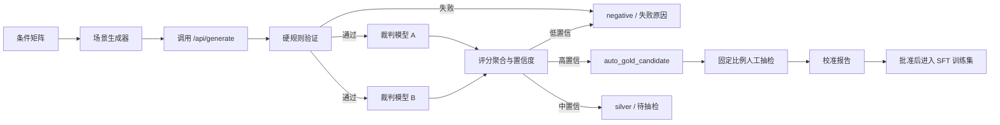

# TripCraft 自动训练数据生成与多模型评审方案

> 版本：v1.0
> 日期：2026-08-15
> 状态：Phase A/B 已实现，待校准并接入批准批次导出

## 1. 目标与边界

目标是在不依赖逐条人工审核的前提下，批量生成覆盖不同旅行条件的候选样本，并通过确定性规则与多个独立模型裁判形成高置信训练候选。

本方案训练的是受限文案能力，不训练实时旅游知识或路线决策。系统仍遵循以下信任边界：

- 规划器决定 POI、顺序、费用、时长、路线和预算。
- RAG 与 POI 数据库提供事实和候选集合。
- 生成模型只能输出 `summary`、`transport_advice`、`note`、`reason`。
- 自动裁判只审核“事实包与文案是否一致、是否清晰、是否匹配偏好”，不替代预算、路线和 POI 的规则校验。
- 自动通过的样本标记为 `auto_gold_candidate`，在经过校准抽检前不能直接升级为人工 `gold`。

## 2. 总体流程



## 3. 场景矩阵

### 3.1 输入维度

批量任务按笛卡尔组合生成，但必须采用配额与分层抽样，避免某些常见城市或偏好淹没数据集。

| 维度 | 建议范围 |
| --- | --- |
| 城市 | 仅选取本地 POI 数量和数据质量达标的城市 |
| 天数 | 1、2、3、5、7 天 |
| 预算 | 紧凑、标准、宽松三个档位，按天数归一化 |
| 偏好 | 自然、人文、美食、亲子、购物、摄影等单项和组合 |
| 人群/节奏 | 独行、亲子、老人、情侣；轻松、标准、紧凑 |
| 限制条件 | 少步行、雨天、室内优先、无障碍、排除类别、收藏 POI |
| 难例 | POI 候选不足、预算接近下限、偏好冲突、远距离候选 |

每次任务记录矩阵版本、随机种子和配额。不要遍历所有组合后无差别调用模型；第一轮建议 500 至 1,000 个覆盖均衡的场景。

### 3.2 生成方式

新建 `model/generate_benchmark_cases.py`，输出固定 JSONL 场景集。新建 `model/run_generation_benchmark.py`，以可配置的 `API_BASE` 调用 `/api/generate`，记录：

- 原始请求与场景 ID
- 生成结果、验证报告、`generation_source`、`validation_status`、`model_version`
- Provider、耗时、重试与回退原因
- POI/规划器版本及输出哈希

批量调用必须具有并发上限、指数退避、单条失败隔离和可从场景 ID 恢复的断点续跑能力。基准任务不能写入真实用户行程或触发用户反馈数据。

## 4. 分层审核

### 4.1 第一层：确定性硬门槛

直接复用 `response_validation_service.py`、`verify_service.py` 和生成响应元数据。以下任一失败，样本直接标为 `negative`，保留结构化错误码：

1. 文案 JSON 不满足 `ItineraryNarrative` Schema。
2. 返回的 `day` 或 `poi_id` 与规划器事实包不完全一致。
3. 出现 Schema 外事实字段，或文案输出篡改 POI、费用、坐标、时长和顺序。
4. `verify_itinerary()` 未通过预算、路线、天数、费用或 POI 校验。
5. 生成结果为确定性降级、修复后仍未通过，或超过调用时延上限。

硬门槛不使用 LLM 打分，也不允许“高质量文案”抵消事实错误。

### 4.2 第二层：多模型裁判

硬门槛通过后，把最小事实包和模型文案发送给至少两个独立裁判。裁判模型必须与被评测生成模型不同；优先使用不同模型家族或不同 Provider，避免同源偏差。

裁判请求不得包含 user_id、邮箱、自由文本反馈、访问令牌或完整用户历史。只发送公开 POI 事实、匿名化偏好和待审文案。

裁判必须以 JSON Schema 返回：

```json
{
  "fact_consistency": 5,
  "preference_match": 4,
  "readability": 5,
  "actionability": 4,
  "unsupported_claims": [],
  "error_codes": [],
  "recommendation": "accept",
  "confidence": 0.93
}
```

维度范围为 1 至 5。`unsupported_claims` 只记录在事实包中不存在的可核验声明，例如编造营业时间、票价、交通时长或景点事实。裁判不能重新选择路线或 POI。

建议第一版配置：

```dotenv
AUTO_EVAL_ENABLED=false
AUTO_EVAL_JUDGE_PROVIDERS=ollama,judge_a
AUTO_EVAL_JUDGE_A_API_BASE=https://your-judge-provider.example/v1/chat/completions
AUTO_EVAL_JUDGE_A_API_KEY=your-judge-key
AUTO_EVAL_JUDGE_A_MODEL=your-judge-model
AUTO_EVAL_MAX_CONCURRENCY=2
AUTO_EVAL_TIMEOUT=45
AUTO_EVAL_ACCEPT_CONFIDENCE=0.90
AUTO_EVAL_SAMPLE_RATE=0.10
```

`AUTO_EVAL_ENABLED` 默认关闭，避免未校准时产生外部 API 成本。

已实现 `judge_a` 与 `judge_b` 两个专用 OpenAI 兼容裁判配置。不得把当前生成教师模型填入裁判配置；系统会按 `model_id` 排除同一模型，自身评审或只剩一个独立裁判时不会产生 `auto_gold_candidate`。

### 4.3 第三层：一致性与置信度聚合

硬门槛通过是前置条件。令两个裁判的归一化平均质量分为 `quality`，维度平均绝对差的反向分数为 `agreement`，两个裁判置信度平均为 `judge_confidence`，不支持事实声明惩罚为 `claim_penalty`：

```text
confidence = 0.45 * quality
           + 0.30 * agreement
           + 0.25 * judge_confidence
           - claim_penalty
```

其中：

- `quality`：四项维度均分除以 5。
- `agreement`：`1 - mean(abs(score_A - score_B)) / 4`。
- `judge_confidence`：两个裁判返回值的平均。
- `claim_penalty`：每个未支持事实声明扣 0.25；任意严重事实声明直接拒绝。

标签规则：

| 条件 | 标签 |
| --- | --- |
| 硬门槛失败，或任一裁判拒绝，或存在严重虚构事实 | `negative` |
| 两裁判均接受、各核心维度 >= 4、差异 <= 1、综合置信度 >= 0.90 | `auto_gold_candidate` |
| 硬门槛通过但未达到自动接收条件 | `silver` |
| 已从抽检与校准中证明自动规则可靠，且得到人工批准 | `gold` |

`auto_gold_candidate` 不能被现有 SFT 导出器当作 `gold` 直接导出；需要显式批准批次或在导出命令中配置允许的已校准标签。

## 5. 数据模型与服务设计

新增以下表或等价的可追溯存储，不把批量实验状态混入 `SavedTrip`：

| 实体 | 核心字段 | 作用 |
| --- | --- | --- |
| `training_scenarios` | scenario_id、request_json、matrix_version、seed、bucket | 可复现的输入条件 |
| `training_generation_runs` | scenario_id、generator_model、response_json、verification_json、latency、hash | 一次端到端生成记录 |
| `training_judgments` | run_id、judge_model、rubric_json、latency、prompt_hash | 单个裁判的结构化结论 |
| `training_auto_labels` | run_id、label、confidence、rule_version、decision_json | 聚合后的候选标签 |
| `training_calibration_samples` | auto_label_id、human_label、agreement、sampled_at | 抽检与误差监控 |

服务职责：

- `training_scenario_service.py`：生成矩阵、分层抽样与配额统计。
- `training_judge_service.py`：裁判 Prompt、结构化调用、超时、脱敏与评分聚合。
- `training_auto_label_service.py`：硬门槛、标签规则和版本化决策。
- `training_calibration_service.py`：随机/风险抽检、自动与人工一致率、阈值建议。

不要复用面向真实用户的 `TrainingReview` 作为自动裁判记录。人工审核池仅用于人工结论和校准；自动运行必须独立存储，方便删除、重跑和成本审计。

## 6. 校准与人工最小化策略

自动评审的目标是减少人工工作，不是证明“无需人工”。上线前先建立 50 至 100 条覆盖不同难度的人工基准集，评估自动规则。

自动标签的准入门槛：

- `auto_gold_candidate` 相对人工基准的精确率 >= 98%。
- 高风险桶（老人、亲子、预算下限、复杂偏好）精确率不得低于总体 2 个百分点。
- 自动判为 `negative` 的样本抽样后，误拒率应低于预设阈值。
- 两裁判超时、失败或分歧率必须可观测；任一裁判不可用时不得静默放宽阈值。

生产阶段的人工工作量：

- 对每批 `auto_gold_candidate` 做 5% 至 10% 随机抽检。
- 高风险桶固定抽检 20%。
- 当某个城市、模型版本或规则版本的精确率下降时，自动提高其抽检率并暂停该桶自动接收。

## 7. 防止评审偏差与数据污染

1. 生成模型不能评审自己的输出。
2. 裁判 Prompt 和标签规则必须版本化；变更后重新校准。
3. 测试集永远不调用自动标签器，不参与 Prompt 修改、阈值选择或模型选择。
4. 训练、验证、测试按标准化请求和有序 POI 序列严格去重。
5. 保留困难负例，防止模型只学习“容易通过”的固定模板。
6. 对同一场景使用多次生成时，保留一个最高质量代表，防止近重复样本扩大权重。
7. 外部 API 调用记录 Provider、模型、token、成本、时延和脱敏状态，不记录密钥。

## 8. 开发顺序与验收

### Phase A：可复现生成

1. 实现场景矩阵和 JSONL manifest。
2. 实现 `/api/generate` 基准调用器、断点续跑和结果存储。
3. 用现有离线验证器完成硬门槛分类。

验收：相同矩阵版本和随机种子生成相同场景；单条失败不会中断任务；每个结果都有输入、版本和验证记录。

### Phase B：裁判与自动标签

1. 实现受 Schema 约束的裁判 Prompt 和两个 Provider。
2. 实现聚合公式、标签规则和规则版本。
3. 写入独立自动评审表，并输出可复现 JSONL 报告。

验收：裁判超时/异常不会自动接收样本；模拟分歧、事实编造和高分一致样本均得到预期标签；外发上下文不含 PII。

### Phase C：校准与训练接入

1. 从自动候选中分层抽样进入现有审核池。
2. 计算自动标签与人工标签的一致率和各桶精确率。
3. 达到校准门槛后，仅把批准批次的 `auto_gold_candidate` 转换为 `gold` 并导出 SFT。

验收：导出 manifest 可追溯到场景、生成、裁判、规则和校准批次；固定 test 集未被使用；不达标的版本无法进入训练导出。

## 9. 成本与运行建议

- 先使用本地 Ollama 作为一个裁判，外部 Provider 只作为第二裁判或抽样复核，控制成本。
- 将批量任务放在队列中，默认并发 1 至 2，避开线上请求高峰。
- 按 `generator_model + judge_model + matrix_version + rule_version` 聚合成本和质量。
- 先执行 100 个场景的 smoke run，观察硬失败率、裁判分歧率、单样本成本和时延，再扩大到 1,000 条。

## 10. 不做的事情

- 不让裁判模型直接选择 POI 或重写路线。
- 不将未经校准的自动通过样本直接混入正式 `gold` SFT 集。
- 不用爬取的大量攻略正文替代事实包或作为无版权审查的训练标签。
- 不在自动任务中写入真实用户私人数据、评分原文或账号信息。
